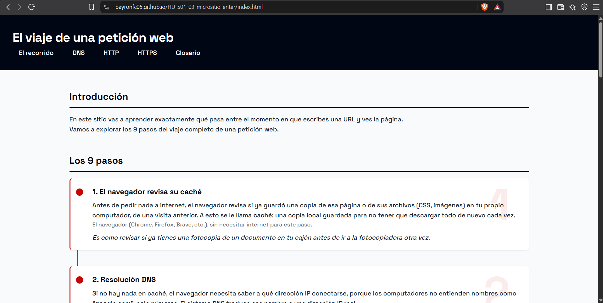
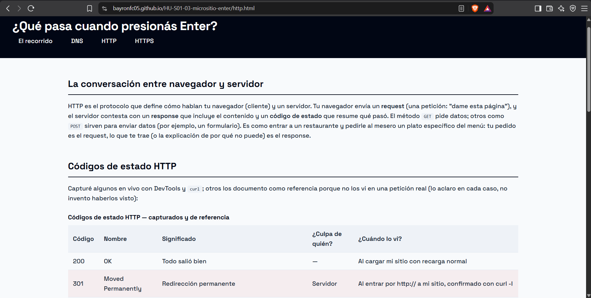
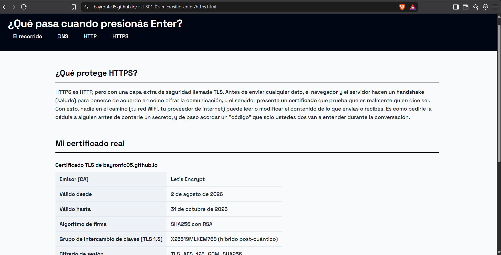

# Micrositio Educativo: ¿Qué pasa cuando presionás Enter?

Un micrositio web educativo e interactivo diseñado para enseñar el recorrido completo de una petición en la web, desde el momento en que se ingresa una URL en el navegador hasta que la interfaz se despliega en pantalla.

- **Demo en vivo:** [https://bayronfc05.github.io/HU-S01-03-micrositio-enter/](https://bayronfc05.github.io/HU-S01-03-micrositio-enter/)
- **Autor:** Bayron Fuentes
- **Programa:** Impulso Digital — Fundación CEPAV (Sprint 01)

---

## Tabla de contenidos

1. [Descripción del proyecto](#1-descripción-del-proyecto)
2. [¿Para quién es este proyecto?](#2-para-quién-es-este-proyecto)
3. [Estructura del micrositio](#3-estructura-del-micrositio)
4. [Las 9 etapas del recorrido web](#4-las-9-etapas-del-recorrido-web)
5. [Experimentos e investigación técnica (X1–X6)](#5-experimentos-e-investigación-técnica-x1x6)
6. [Decisiones técnicas tomadas](#6-decisiones-técnicas-tomadas)
7. [Capturas](#7-capturas)
8. [Estructura del repositorio](#8-estructura-del-repositorio)
9. [Cómo ejecutar y explorar localmente](#9-cómo-ejecutar-y-explorar-localmente)
10. [Tecnologías y estándares utilizados](#10-tecnologías-y-estándares-utilizados)
11. [Fuentes y referencias técnicas](#11-fuentes-y-referencias-técnicas)

---

## 1. Descripción del proyecto

El proyecto aborda el reto pedagógico de explicar la infraestructura sobre la cual operan las aplicaciones web. La mayoría de los desarrolladores principiantes aprenden a maquetar o programar sin entender los protocolos de red, la resolución de nombres, el cifrado o el almacenamiento en caché.

Este micrositio explica de forma accesible —mediante lenguaje directo, analogías del mundo real y mediciones técnicas sobre su propia infraestructura de despliegue— cómo interactúan clientes, resolutores DNS, proxies CDN y servidores de origen durante el ciclo de vida de una petición HTTP/HTTPS.

## 2. ¿Para quién es este proyecto?

Este micrositio está pensado para **estudiantes interesados en tecnología, de 16 años en adelante, sin experiencia previa en el área** — el mismo perfil que describe el programa de Fundación CEPAV. No asume conocimientos previos: cada término técnico se explica la primera vez que aparece, y el contenido está apoyado en analogías del mundo real, no en jerga.

Más detalle sobre el público objetivo, el problema que resuelve y cómo mediría si alguien aprendió con él está en [`docs/NEGOCIO.md`](docs/NEGOCIO.md).

## 3. Estructura del micrositio

El sitio consta de cuatro páginas interconectadas mediante navegación semántica y accesible:

- **`index.html` (El Recorrido):** línea de tiempo principal con las 9 etapas cronológicas de la petición, acompañada por un glosario técnico de 15 términos.
- **`dns.html` (DNS):** cómo se traduce un dominio a una dirección IP, con un cuadro comparativo de resultados reales de `nslookup` sobre 6 dominios.
- **`http.html` (HTTP):** arquitectura cliente-servidor (request/response), tabla de 10 códigos de estado HTTP y desglose de cabeceras reales capturadas con `curl -I`.
- **`https.html` (HTTPS):** cifrado de comunicaciones vía TLS 1.3, inspección del certificado del sitio con `openssl`, y los vectores de tráfico que HTTPS **no** protege.

## 4. Las 9 etapas del recorrido web

1. **El navegador revisa su caché** — verificación local de recursos previamente almacenados (HTML, CSS, imágenes).
2. **Resolución DNS** — traducción del nombre de dominio (`bayronfc05.github.io`) a una dirección IP.
3. **Conexión TCP (handshake de 3 vías)** — establecimiento del canal de transporte mediante paquetes `SYN → SYN-ACK → ACK`.
4. **Handshake TLS y verificación del certificado** — negociación del cifrado y validación de identidad con la CA (Let's Encrypt).
5. **Envío del request HTTP GET** — emisión de la solicitud del recurso por parte del cliente.
6. **Procesamiento y respuesta del servidor** — evaluación de la solicitud y entrega de contenido junto con un código de estado (ej. `200 OK`).
7. **Parseo del HTML** — conversión del texto plano devuelto en la estructura de árbol DOM.
8. **Descarga de recursos secundarios** — solicitud en paralelo de `style.css`, tipografías y demás recursos.
9. **Renderizado y pintado en pantalla** — cálculo de layout (*reflow*) y dibujo de píxeles (*paint*) en la interfaz.

## 5. Experimentos e investigación técnica (X1–X6)

El sitio se construyó a partir de experimentos reales hechos desde la consola y DevTools sobre la red:

| # | Experimento | Archivo | Qué mide |
|---|---|---|---|
| X1 | Arqueología DNS | [`investigacion/dns.md`](investigacion/dns.md) | Direcciones IPv4/IPv6, tipos de registro (A, AAAA) y TTL, vía `nslookup` |
| X2 | Rastreo de ruta | [`investigacion/ruta.md`](investigacion/ruta.md) | Saltos de red y topología hacia el servidor, vía `tracert` |
| X3 | Medición de latencia | [`investigacion/latencia.md`](investigacion/latencia.md) | RTT hacia nodos locales y remotos, vía `ping` |
| X4 | Inspección de cabeceras HTTP | [`investigacion/headers.md`](investigacion/headers.md) | Headers reales con `curl -I`; identifica la aceleración vía CDN de Fastly en Bogotá (`X-Served-By: cache-bog...`) |
| X5 | Certificado TLS/SSL | [`investigacion/tls.md`](investigacion/tls.md) | Handshake TLS 1.3 con `openssl s_client`; grupo de intercambio de llaves con resistencia poscuántica (`X25519MLKEM768`) |
| X6 | Códigos de estado HTTP | [`investigacion/codigos.md`](investigacion/codigos.md) | 200 OK, 301 Moved Permanently, 307 HSTS Internal Redirect, 304 Not Modified, 404 Not Found, 401 Unauthorized |

## 6. Decisiones técnicas tomadas

- **Cero frameworks de CSS.** Todo el sistema visual (variables de color, la línea de tiempo, las tarjetas del glosario) está hecho con CSS puro (Flexbox y Grid), sin librerías externas — es requisito explícito de la HU y además obliga a entender cada propiedad que se usa.
- **Sin JavaScript.** La línea de tiempo de las 9 etapas está maquetada solo con CSS (`::before`/`::after` para la línea vertical y los círculos), sin animaciones ni interactividad con JS, también por requisito de alcance del sprint.
- **Identidad visual propia:** paleta basada en `#010614` (azul casi negro) y `#c80606` (rojo), con la tipografía `Space Grotesk` para títulos — decisión estética personal, no una plantilla descargada.
- **Un archivo CSS único (`estilos/style.css`).** En un punto del desarrollo hubo dos archivos de variables que se pisaban entre sí; se consolidaron en uno solo para evitar bugs de especificidad.
- **Todas las mediciones son propias.** Ningún dato de las tablas (DNS, headers, certificado, códigos de estado) está inventado ni copiado de otro sitio: cada uno se capturó con herramientas reales (`nslookup`, `curl -I`, `openssl s_client`, DevTools) contra mi propio dominio u otros dominios públicos.
- **`docs/BITACORA.md` y `docs/NEGOCIO.md` viven en una carpeta `docs/`**, separados del resto del contenido del sitio, para mantener claro qué es "documentación del proceso" (bitácora, negocio) versus "el entregable en sí" (las páginas HTML, los experimentos).

## 7. Capturas

**`index.html` — Las 9 etapas del recorrido, maquetadas como línea de tiempo con CSS puro:**



**`http.html` — Tabla de códigos de estado HTTP, capturados en vivo o documentados como referencia:**



**`https.html` — Certificado TLS real del sitio, verificado con `openssl s_client`:**

``

## 8. Estructura del repositorio

```text
HU-S01-03-micrositio-enter/
├── docs/
│   ├── BITACORA.md         # Registro diario de actividades y progreso
│   ├── NEGOCIO.md          # Documento de visión de negocio y análisis de costos
│   └── capturas/           # Screenshots del sitio en vivo (ver sección 7)
├── ejercicios/             # Reportes de ejercicios prácticos
│   ├── img/                # Evidencias y capturas PNG de respuestas HTTP
│   ├── dns.md               # Ejercicio E2
│   ├── http.md               # Cacería de códigos HTTP (E3)
│   ├── merge.md               # Resolución de conflictos Git (E5)
│   └── terminal.md               # Reto de terminal sin mouse (E1)
├── estilos/
│   └── style.css           # Hoja de estilos globales (variables, Flexbox, Grid, responsive)
├── investigacion/          # Reportes detallados de los experimentos X1 a X6
│   ├── codigos.md          # Experimento X6
│   ├── dns.md               # Experimento X1
│   ├── FUENTES.md            # Referencias técnicas y especificaciones RFC
│   ├── headers.md            # Experimento X4
│   ├── latencia.md            # Experimento X3
│   ├── ruta.md                # Experimento X2
│   └── tls.md                 # Experimento X5
├── .gitignore
├── dns.html                # Módulo explicativo de DNS y mediciones
├── http.html                # Módulo de HTTP, headers y códigos de estado
├── https.html                # Módulo de HTTPS, TLS y seguridad
├── index.html               # Página principal (las 9 etapas y el glosario)
└── README.md                # Este documento
```

## 9. Cómo ejecutar y explorar localmente

1. Clonar el repositorio:
   ```bash
   git clone https://github.com/bayronfc05/HU-S01-03-micrositio-enter.git
   ```
2. Entrar a la carpeta del proyecto:
   ```bash
   cd HU-S01-03-micrositio-enter
   ```
3. Abrir en el navegador:
   - Abrir directamente `index.html` con el navegador, **o**
   - Usar una extensión de servidor local como *Live Server* en VS Code (recomendado, para que las rutas relativas se comporten igual que en producción).

## 10. Tecnologías y estándares utilizados

- **HTML5 semántico:** `<header>`, `<nav>`, `<main>`, `<section>`, `<footer>`, `<ol>`, `<dl>`, con jerarquía de encabezados válida.
- **CSS3 puro:** CSS Grid y Flexbox, variables CSS para consistencia cromática, diseño responsive y foco visible (`:focus-visible`) para accesibilidad por teclado.
- **Herramientas de consola:** `curl`, `openssl`, `nslookup`, `ping`, `tracert`, comandos POSIX/Git Bash.
- **Control de versiones:** Git (ramas, resolución de conflictos de merge, commits semánticos), desplegado en GitHub Pages.

## 11. Fuentes y referencias técnicas

Las bases teóricas y técnicas del sitio están sustentadas en estándares oficiales, documentados en [`investigacion/FUENTES.md`](investigacion/FUENTES.md):

- RFC 9110 — HTTP Semantics (IETF)
- RFC 9111 — HTTP Caching (IETF)
- RFC 8446 — The Transport Layer Security (TLS) Protocol Version 1.3 (IETF)
- RFC 1034 / 1035 — Domain Names: Concepts and Facilities / Implementation and Specification (IETF)
- WHATWG — HTML Living Standard & Fetch Specification

---

Micrositio educativo desarrollado por Bayron Fuentes (2026) como parte del programa de formación técnica de Fundación CEPAV.